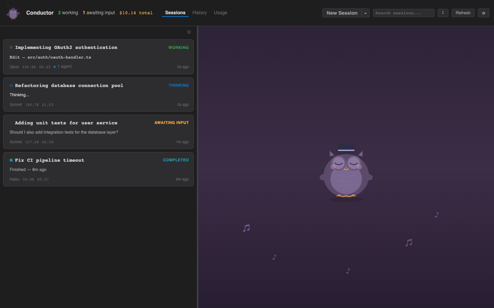

# Conductor

[](https://github.com/anthropics/conductor/actions/workflows/ci.yml)
[](https://marketplace.visualstudio.com/items?itemName=conductor.conductor)
[](https://ko-fi.com/taitopia)

Real-time VS Code dashboard for monitoring [Claude Code](https://claude.ai/code) AI agent activity, tool usage, and token consumption.



## Features

- **Live Session Monitoring** — See all active Claude Code sessions with real-time status updates (active, idle, waiting for input)
- **Sub-Agent Tracking** — Hierarchical view of parent sessions and their spawned sub-agents
- **Tool Usage Analytics** — Track which tools are being called, how often, error rates, and average duration
- **Token Consumption** — Per-session and per-model token counts with USD cost estimates
- **Activity Feed** — Scrolling feed of tool calls, text outputs, and user inputs across all sessions
- **Incremental Parsing** — Efficient JSONL parsing that reads only new data, not entire files
- **Hybrid File Watching** — VS Code FileSystemWatcher + 1-second polling fallback for reliability across platforms

## Requirements

- **VS Code** 1.85.0 or later
- **Claude Code CLI** installed and active (sessions must exist in `~/.claude/projects/`)
- **Node.js** 20.0.0 or later (for development)

## Getting Started

1. Install the extension from the VS Code Marketplace (or build from source)
2. Open the Command Palette (`Cmd+Shift+P` / `Ctrl+Shift+P`)
3. Run **"Conductor: Open"**
4. Start a Claude Code session — the dashboard updates automatically

You can also click the **$(pulse) Conductor** status bar item to open the dashboard.

## Commands

| Command | Description |
|---------|-------------|
| `Conductor: Open` | Open the monitoring dashboard |
| `Conductor: Refresh` | Force refresh all session data |

## Token Pricing

Cost estimates use the following rates (per million tokens):

| Model | Input | Output | Cache Read | Cache Creation |
|-------|-------|--------|------------|----------------|
| Claude Opus 4.6 | $15.00 | $75.00 | $1.50 | $18.75 |
| Claude Sonnet 4.6 | $3.00 | $15.00 | $0.30 | $3.75 |
| Claude Haiku 4.5 | $0.80 | $4.00 | $0.08 | $1.00 |

> Pricing is hardcoded and may not reflect current Anthropic rates. See `src/analytics/TokenCounter.ts` for details.

## Architecture

The extension reads JSONL transcript files from `~/.claude/projects/` and processes them through a pipeline:

```
JSONL Files → ProjectScanner → TranscriptWatcher → JsonlParser → SessionTracker → Dashboard UI
```

- **Extension backend** (Node.js): Watches files, parses records, tracks session state
- **Webview frontend** (React + Zustand): Renders the dashboard UI via IPC messages

For detailed architecture documentation, see [docs/architecture.md](docs/architecture.md).

## Development

```bash
# Install all dependencies
npm install && cd webview-ui && npm install

# Build everything
npm run build

# Watch mode (extension)
npm run watch

# Webview dev server (separate terminal)
cd webview-ui && npm run dev

# Run tests
npm test

# Type checking
npm run lint

# Generate API docs
npm run docs
```

Press **F5** in VS Code to launch the Extension Development Host for debugging.

## Contributing

See [CONTRIBUTING.md](CONTRIBUTING.md) for development setup, coding standards, and PR guidelines.

## Known Limitations

- Token pricing is hardcoded — must update source code when Anthropic changes rates
- Tool input summaries only cover 9 built-in tools — custom tools show empty summaries
- No webview dev stub — running `npm run dev` in `webview-ui/` crashes outside VS Code
- Session focus state can drift between extension and webview stores

## License

[MIT](LICENSE)
